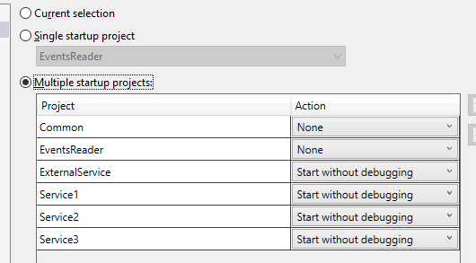
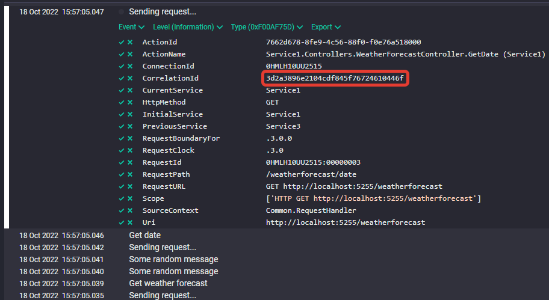

# Request Sequence Visualization

Modern requests to web services are very complex. The service you are calling can call other services, they are other services, etc. All these requests can be executed in parallel. Of course, the logging system stores information from all participants in the request. But the clocks on different services can be slightly out of sync, so it is not easy to recreate the correct picture. And if we add message queues here (Azure EventHub, RabbitMQ, ...), the task becomes even more difficult.

Here I'll try to create a system that will allow us to quickly plot the sequence diagram of events during my request.

## Prerequisites

You must have [Docker](https://www.docker.com/products/docker-desktop/) installed. The project uses [Seq](https://datalust.co/seq) for collecting logs. You'll be able to start it using Docker Compose.

## How to use

* Compile the solution (`RequestsSequence.sln`).
* Start Seq using `docker-compose.yaml`:

```bash
docker compose -f "docker-compose.yml" up -d
```

* Start all services from the solution:



* Make a request to `http://localhost:5222/weatherforecast` (e. g. through browser).
* Go to Seq on `http://localhost:9090`:


 
* Copy correlation id to clipboard
* Insert the correlation id into [Program.cs](https://github.com/yakimovim/request-sequence-visualization/blob/496beb7126ddcd224471195bad4d3f19a9365fe9/EventsReader/Program.cs#L9) of `EventsReader` project.
* Run the `EventsReader` application.
* Copy the application output into clipboard
* Paste the clipboard content into [www.websequencediagrams.com](https://www.websequencediagrams.com/).

## Main points

* [How to get information from incoming request](https://github.com/yakimovim/request-sequence-visualization/blob/496beb7126ddcd224471195bad4d3f19a9365fe9/Common/LoggingMiddleware.cs#L31)
* [How to send information with outgoing request](https://github.com/yakimovim/request-sequence-visualization/blob/496beb7126ddcd224471195bad4d3f19a9365fe9/Common/RequestHandler.cs#L30)
* [How does the monotonous clock work](https://github.com/yakimovim/request-sequence-visualization/blob/496beb7126ddcd224471195bad4d3f19a9365fe9/Common/RequestClockProvider.cs#L3)
* [How to build request sequence diagram](https://github.com/yakimovim/request-sequence-visualization/blob/496beb7126ddcd224471195bad4d3f19a9365fe9/EventsReader/Program.cs#L6)

## Articles

* [English]() (not ready yet)
* [Russian]() (not ready yet)